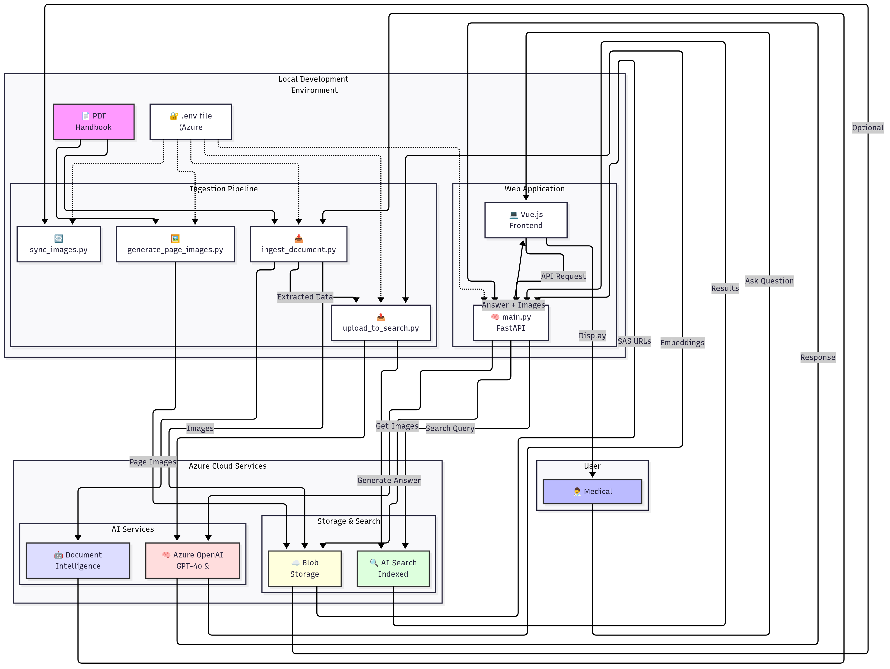

# Clinical Skills Handbook AI Assistant

A sophisticated Multimodal Retrieval-Augmented Generation (MM-RAG) application that transforms the RCSI Clinical Skills Handbook into an intelligent, searchable assistant for medical professionals.



## 🎯 What This Does

This system creates an AI-powered assistant that:
- **Understands medical questions** in natural language
- **Searches through handbook content** using advanced AI techniques
- **Provides accurate answers** with relevant images and diagrams
- **Cites specific pages** for verification
- **Maintains conversation context** for follow-up questions

## 📚 Documentation

- **[📖 Complete Implementation Guide](IMPLEMENTATION_GUIDE.md)** - Step-by-step setup instructions for beginners
- **[🔧 Scripts Reference Guide](SCRIPTS_REFERENCE.md)** - Detailed documentation for each script
- **[🤖 AI Development Guide](AI_DEVELOPMENT_GUIDE.md)** - How this entire project was built in hours using Cursor AI
- **[🏗️ Architecture Overview](#architecture)** - How the system works

### 🚀 Built with AI in Hours, Not Weeks
This entire project was developed using Cursor AI through natural conversation. Read the [AI Development Guide](AI_DEVELOPMENT_GUIDE.md) to learn:
- How to build complex applications through conversation
- Prompting techniques that led to instant solutions
- Why this took hours instead of weeks
- How to leverage AI for your own rapid development

## 🚀 Quick Start

### Prerequisites
- Windows 10/11
- Python 3.11+
- Node.js 16+
- Azure Account (free tier works)
- RCSI Clinical Skills Handbook PDF

### Fast Track Setup

1. **Clone and Setup**
   ```bash
   git clone [repository-url]
   cd final
   python -m venv venv
   venv\Scripts\activate
   pip install -r requirements.txt
   ```

2. **Configure Azure Services**
   ```bash
   copy env.example .env
   # Edit .env with your Azure credentials
   ```

3. **Process the Handbook**
   ```bash
   python ingest_document.py --file handbook.pdf
   python generate_page_images.py handbook.pdf
   python upload_to_search.py --recreate
   ```

4. **Launch the Application**
   ```bash
   # Terminal 1: Backend
   uvicorn main:app --reload
   
   # Terminal 2: Frontend
   cd my-medical-chatbot
   npm install
   npm run dev
   ```

5. **Access the Assistant**
   - Open browser to http://localhost:5173
   - Start asking clinical questions!

## 🏗️ Architecture

The system consists of four main components working together:

### 1. **Ingestion Pipeline** 
Processes the PDF handbook to extract knowledge:
- `ingest_document.py` - Extracts text and images using AI
- `generate_page_images.py` - Creates full-page previews
- `upload_to_search.py` - Creates searchable index

### 2. **Azure Cloud Services**
Provides the AI brain and storage:
- **Document Intelligence** - Understands PDF structure
- **Blob Storage** - Stores extracted images
- **Azure OpenAI** - Powers intelligent responses
- **AI Search** - Enables semantic search

### 3. **Backend API** 
FastAPI server that orchestrates everything:
- Receives questions from users
- Searches for relevant content
- Generates accurate responses
- Manages secure image access

### 4. **Frontend Interface**
Modern Vue.js chat application:
- Clean, medical-professional-friendly UI
- Displays text answers with citations
- Shows relevant diagrams and images
- Maintains conversation history

## 📁 Project Structure

```
final/
├── 📚 Documentation
│   ├── README.md                    # This file
│   ├── IMPLEMENTATION_GUIDE.md      # Complete setup guide
│   └── SCRIPTS_REFERENCE.md         # Script documentation
│
├── 🔧 Ingestion Scripts
│   ├── ingest_document.py           # Extract content from PDF
│   ├── generate_page_images.py      # Convert pages to images
│   ├── upload_to_search.py          # Create search index
│   └── sync_images.py               # Download images locally
│
├── 🖥️ Application
│   ├── main.py                      # FastAPI backend
│   └── my-medical-chatbot/          # Vue.js frontend
│       ├── src/
│       │   ├── App.vue
│       │   └── components/
│       │       └── ChatComponent.vue
│       └── package.json
│
├── 🛠️ Utilities
│   ├── check_index.py               # Verify search index
│   └── check_embeddings.py          # Check embedding status
│
├── 📋 Configuration
│   ├── requirements.txt             # Python dependencies
│   ├── env.example                  # Environment template
│   └── index_schema.json            # Search index structure
│
└── 📁 Data (generated)
    ├── processed_handbook.jsonl     # Extracted content
    ├── page_urls.json               # Page image mappings
    └── static/
        ├── images/                  # Extracted visuals
        └── pages/                   # Full page images
```

## 🌟 Key Features

### Intelligent Search
- **Hybrid Search**: Combines keyword and semantic understanding
- **Multimodal**: Searches both text and image descriptions
- **Context-Aware**: Understands medical terminology

### Accurate Responses
- **Grounded Answers**: Only uses handbook content
- **Visual Support**: Includes relevant diagrams
- **Page Citations**: Always provides sources

### Professional Interface
- **Clean Design**: Medical-professional friendly
- **Fast Response**: Optimized for quick lookups
- **Conversation Memory**: Handles follow-up questions

## 🔍 Example Usage

**Question**: "How do I perform a cardiovascular examination?"

**Response**: The assistant will:
1. Search for cardiovascular examination content
2. Find relevant text and diagrams
3. Generate a clear, step-by-step answer
4. Include images of examination techniques
5. Cite specific handbook pages

## 🛡️ Security & Privacy

- All data stays within your Azure subscription
- Images served with time-limited SAS tokens
- No external API calls except to Azure
- Suitable for sensitive medical content

## 🚧 Troubleshooting

Common issues and solutions are covered in:
- [Implementation Guide - Troubleshooting](IMPLEMENTATION_GUIDE.md#troubleshooting)
- [Scripts Reference - Troubleshooting](SCRIPTS_REFERENCE.md#troubleshooting-scripts)

Quick checks:
- Ensure all Azure services are running
- Verify `.env` file has correct credentials
- Check Python virtual environment is activated
- Confirm Poppler is installed (for PDF processing)

## 📈 Performance Optimization

- **Batch Processing**: Large PDFs processed in chunks
- **Parallel Operations**: Scripts can run simultaneously
- **Caching**: Embeddings cached in search index
- **Local Images**: Optional local storage for speed

## 🔮 Future Enhancements

Potential improvements:
- Multi-language support
- Voice input/output
- Mobile application
- Integration with medical databases
- Export conversation summaries

## 🤝 Contributing

Contributions are welcome! Please:
1. Fork the repository
2. Create a feature branch
3. Follow the existing code style
4. Add appropriate documentation
5. Submit a pull request

## 📄 License

This project is designed for educational and professional medical training purposes. Ensure compliance with your organization's policies when deploying.

## 🙏 Acknowledgments

- Built with Azure AI services
- Uses the RCSI Clinical Skills Handbook
- Powered by GPT-4o for intelligent responses
- Vue.js for the modern interface

---

**Need Help?** 
- 📖 Read the [Implementation Guide](IMPLEMENTATION_GUIDE.md) for detailed setup
- 🔧 Check the [Scripts Reference](SCRIPTS_REFERENCE.md) for script details
- 🐛 See [Troubleshooting](IMPLEMENTATION_GUIDE.md#troubleshooting) for common issues

**Quick Links:**
- [Azure Portal](https://portal.azure.com)
- [Python Downloads](https://python.org/downloads)
- [Node.js Downloads](https://nodejs.org)
- [Poppler for Windows](https://github.com/oschwartz10612/poppler-windows/releases) 